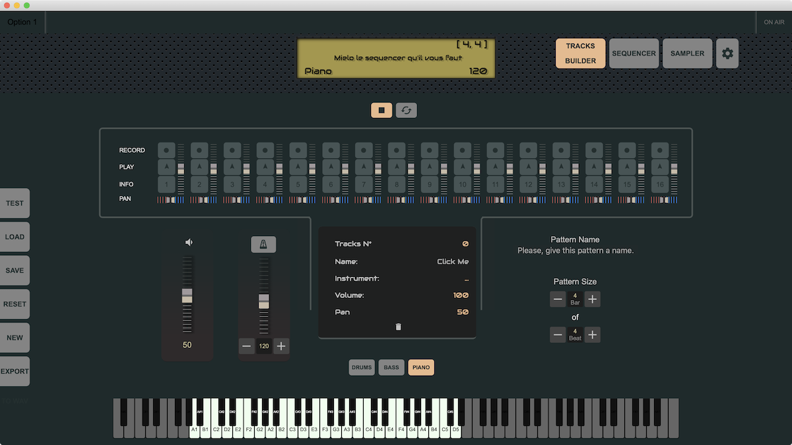

<h1>Mielo Audio</h1>

Track Builder, Sequencer and Sampler app working with MIDI and computer keyboards.
<ul>
	<li>
		Interface build with Vue.js and Webview
	</li>
	<li>
		Rust App engine with <a href = 'https://tauri.studio/en/'>Tauri</a> 
	</li>
	<li>
		Rust Audio Engine build with <a gref = 'https://docs.rs/rodio/0.13.0/rodio/'>Rodio (Audio Playback)</a> and <a href = ''>CPAL (Low-level library for audio input and output in pure Rust)</a>.
	</li>
</ul>

<ul>
	<li>
		<b>Track Builder:</b>
		<ul>
			<li>
				Pattern Loop build from 16 tracks with individual volume and stereo (pan) controls.
			</li>
			<li>
				Set the size of your loop (bar and beat), the tempo and start playing your notes with the choosen instrument on a MIDI or computer keyboard track by track.
			</li>
			<li>
				The piano keys let you see which ones can play a sound (click on it to play this sound), It can be a complete instrument or a set of custom sounds (drums, ambient sound, ...). In the next version you will be able to click on one of the greyed keys to directly add a new sound.
			</li>
		</ul>
	</li>
</ul>

	

